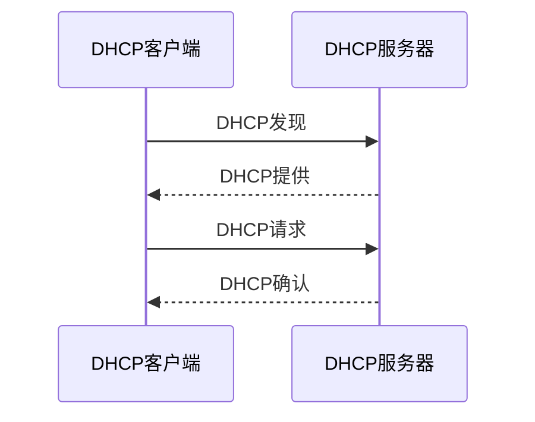

---

subject: 计算机网络
chapter: 06 应用层
---

## 1. 网络应用模型

### 1.1 客户/服务器方式（C/S方式）

- **客户（Client）**：请求服务的一方。客户程序必须知道服务器程序的地址，不需要特殊的硬件和很复杂的操作系统。
- **服务器（Server）**：提供服务的一方。服务器程序不需要预先知道客户程序的地址，需要强大的硬件和高级的操作系统支持。
- **特点**：
  - 服务器端一直运行，被动等待客户请求
  - 客户端主动发起请求
  - 服务器可同时为多个客户服务

### 1.2 对等方式（P2P方式）

- 在P2P方式中，没有固定的客户和服务器划分，每个对等方既可充当客户也可充当服务器。
- **特点**：
  - 每个节点既是客户端也是服务器端
  - 系统可扩展性好（用户越多资源越丰富）
  - 网络边缘节点参与服务
- **应用**：BT下载、Skype等

### 1.3 对比

| 特性 | C/S方式 | P2P方式 |
|------|---------|---------|
| 中心服务器 | 需要 | 不需要 |
| 可扩展性 | 受服务器限制 | 好 |
| 管理难度 | 较易 | 较难 |
| 安全性 | 较高 | 较低 |

## 2. 域名系统DNS

### 2.1 概述

- 域名系统DNS（Domain Name System）是因特网使用的命名系统，用来把便于人们使用的机器名字转换为IP地址。
- **为什么需要DNS**：IP地址不便记忆，域名便于人们使用，但TCP/IP通信需要IP地址，因此需要DNS完成域名到IP地址的转换。

### 2.2 因特网的域名结构

因特网采用**层次树状结构**的命名方法。域名由标号序列组成，各标号之间用点隔开：

```
...三级域名.二级域名.顶级域名
```

- **顶级域名**分为三大类：
  1. **国家/地区顶级域名**：.cn（中国）、.us（美国）、.jp（日本）
  2. **通用顶级域名**：.com（公司）、.net（网络服务机构）、.org（非营利组织）、.edu（教育机构）、.gov（政府部门）
  3. **基础结构域名**：.arpa（反向域名解析）

- **二级域名**：在顶级域名之下注册。如 `.com.cn`、`.edu.cn`
- **三级域名**：在二级域名之下注册。如 `tsinghua.edu.cn`

> **⚠ 注意**：域名只是逻辑概念，不反映计算机所在的物理地点。

### 2.3 域名服务器

DNS采用**分布式**的域名服务器系统，分为四种类型：

1. **根域名服务器**：最高层次的域名服务器，所有根域名服务器都知道所有顶级域名服务器的IP地址。全球共13组根域名服务器。
2. **顶级域名服务器**：负责管理在该顶级域名服务器注册的所有二级域名。
3. **权限域名服务器**：负责管理一个区的域名服务器。
4. **本地域名服务器**：每个ISP或大学都可以拥有一个本地域名服务器，也叫默认域名服务器。

### 2.4 域名解析过程

域名到IP地址的解析由域名服务器完成，有两种查询方式：

**递归查询**：主机向本地域名服务器的查询通常是递归查询。如果本地域名服务器不知道答案，就代替主机继续向其他域名服务器查询，直到得到结果。

**迭代查询**：本地域名服务器向根域名服务器的查询通常是迭代查询。根域名服务器要么给出结果，要么告诉本地域名服务器下一步应该向哪个域名服务器查询。

**完整解析流程**：
1. 主机向本地域名服务器发起**递归查询**
2. 本地域名服务器向根域名服务器发起**迭代查询**
3. 根域名服务器返回顶级域名服务器地址
4. 本地域名服务器向顶级域名服务器查询
5. 顶级域名服务器返回权限域名服务器地址
6. 本地域名服务器向权限域名服务器查询
7. 权限域名服务器返回最终IP地址

> **高速缓存**：每个域名服务器都维护一个高速缓存，存放最近查询过的域名及IP地址映射。这样可以大大减少查询时间。

## 3. 动态主机配置协议DHCP

### 3.1 DHCP的作用

- DHCP（Dynamic Host Configuration Protocol）提供了**即插即用连网**机制。
- 允许一台计算机加入新网络时自动获取IP地址，而不用手工配置。
- DHCP基于**UDP**工作，服务器端口67，客户端口68。

### 3.2 DHCP的工作过程

DHCP采用客户-服务器方式，工作过程分为四步：

**第一步：DHCP发现（DHCP DISCOVER）**
- 客户端广播发送发现报文
- 源IP：0.0.0.0（尚未分配IP）
- 目的IP：255.255.255.255（广播）

**第二步：DHCP提供（DHCP OFFER）**
- 服务器广播发送提供报文
- 包含：分配的IP地址、子网掩码、地址租期、默认网关、DNS服务器

**第三步：DHCP请求（DHCP REQUEST）**
- 客户端广播发送请求报文
- 包含：选择的DHCP服务器IP地址、请求租用的IP地址

**第四步：DHCP确认（DHCP ACK）**
- 被选中的服务器发送确认报文
- 客户端收到后即可使用租用的IP地址

> **⚠ 注意**：客户端使用前还会进行ARP检测，确保该IP地址未被其他主机占用。

### 3.3 租约更新

- 当租用期过了一半（T1），客户端向服务器发送DHCP REQUEST请求更新租约
- 服务器若同意，发回DHCP ACK，租约更新
- 服务器若不同意，发回DHCP NACK，客户端必须重新申请
- 若租用期过了87.5%（T2）仍未收到服务器响应，客户端重新广播DHCP REQUEST

### 3.4 DHCP中继代理

- 不需要每个网络都配置DHCP服务器
- 使用DHCP中继代理转发DHCP报文到其他网络的DHCP服务器
- 中继代理收到广播的DHCP发现报文后，以单播方式转发给DHCP服务器

**【技巧】目的地址始终是全1**。



## 4. 文件传送协议FTP

### 4.1 FTP概述

- FTP（File Transfer Protocol）是因特网上使用最广泛的文件传送协议。
- FTP提供交互式的访问，允许客户指明文件的类型与格式，并允许文件具有存取权限。
- FTP使用**TCP**连接，提供可靠传输。

### 4.2 FTP基本工作原理

FTP使用两个并行的TCP连接：

1. **控制连接**：端口21，在整个会话期间保持打开，用于传送FTP控制命令
2. **数据连接**：用于传送文件，每次文件传输时建立，传输完毕后关闭

**主动模式**：
- 服务器从端口20主动连接客户端指定的端口
- 客户端打开一个端口并通知服务器

**被动模式**：
- 服务器打开一个随机端口并通知客户端
- 客户端主动连接服务器指定的端口

> **⚠ 注意**：FTP控制连接在整个会话期间保持打开，数据连接在每次传输完毕后关闭。FTP是**带外控制**（控制信息和数据使用不同连接）。

## 5. 电子邮件

### 5.1 邮件发送和接收过程

电子邮件系统的三个主要组成部分：
1. **用户代理**：用户读写和管理邮件的软件（如Outlook、Foxmail）
2. **邮件服务器**：发送和接收邮件的核心，同时负责维护用户的邮箱
3. **协议**：发送协议（SMTP）和读取协议（POP3/IMAP）

邮件发送流程：
1. 发件人用户代理 → 发件方邮件服务器（SMTP）
2. 发件方邮件服务器 → 收件方邮件服务器（SMTP）
3. 收件方邮件服务器 → 收件人用户代理（POP3/IMAP）

### 5.2 简单邮件传送协议SMTP

- SMTP（Simple Mail Transfer Protocol）用于**发送**邮件，使用TCP连接，端口25。
- SMTP通信的三个阶段：
  1. **连接建立**：客户端与服务器建立TCP连接
  2. **邮件传送**：客户端发送邮件，服务器接收
  3. **连接释放**：邮件发送完毕，释放TCP连接

- **SMTP的缺点**：
  - 只能传送7位ASCII码文本
  - 不能传送非英文文本和二进制文件
  - 解决方案：MIME（多用途互联网邮件扩展）

### 5.3 MIME

MIME（Multipurpose Internet Mail Extensions）在SMTP基础上扩展：
- 允许传送非ASCII码内容（图片、音频、视频等）
- 通过Content-Type和Content-Transfer-Encoding首部说明数据类型和编码方式

### 5.4 邮件读取协议

**POP3（Post Office Protocol v3）**：
- 端口110，使用TCP连接
- 下载并保留 / 下载并删除 两种方式
- 功能简单，不支持在服务器上管理邮件

**IMAP（Internet Message Access Protocol）**：
- 端口143，使用TCP连接
- 可以在服务器上管理邮件（创建文件夹、搜索等）
- 支持只下载邮件首部，需要时再下载正文
- 比POP3更灵活

### 5.5 基于万维网的电子邮件

- 用户通过浏览器访问邮件服务（如Gmail、QQ邮箱）
- 发送和接收邮件使用HTTP协议（而不是SMTP/POP3）
- 邮件服务器之间仍使用SMTP

## 6. 万维网WWW

### 6.1 概述

- 万维网WWW（World Wide Web）是一个大规模的联机式信息储藏所。
- 万维网用**链接**的方法从互联网上的一个站点访问另一个站点。
- 万维网以**客户-服务器**方式工作。

**三个重要概念**：
1. **URL**（统一资源定位符）：标志万维网上的各种文档，格式：`协议://主机:端口/路径?查询#片段`
2. **HTML**（超文本标记语言）：描述万维网页面的标准语言
3. **HTTP**（超文本传送协议）：应用层协议，使用TCP连接进行可靠传送

### 6.2 HTTP协议

#### 6.2.1 HTTP的工作过程

1. 服务器不断监听TCP端口80
2. 浏览器向服务器发出连接建立请求
3. 建立TCP连接后，浏览器发出HTTP请求
4. 服务器返回HTTP响应
5. 释放TCP连接

**HTTP/1.0**：非持续连接，每个对象需要单独建立TCP连接
**HTTP/1.1**：持续连接，一个TCP连接可传送多个对象
  - 非流水线方式：收到响应后才发下一个请求
  - 流水线方式：连续发送请求，不必等待响应

#### 6.2.2 HTTP报文格式

**请求报文**：
```
方法 URL 版本
首部字段名: 值
...
空行
实体主体（POST时使用）
```

**响应报文**：
```
版本 状态码 短语
首部字段名: 值
...
空行
实体主体
```

**HTTP请求方法**：

| 方法 | 说明 | 幂等性 |
|------|------|--------|
| GET | 获取资源 | 是 |
| POST | 提交数据 | 否 |
| PUT | 替换资源 | 是 |
| DELETE | 删除资源 | 是 |
| HEAD | 获取首部 | 是 |

**HTTP状态码**：

| 类别 | 含义 | 常见例子 |
|------|------|---------|
| 1xx | 信息类 | 100 Continue |
| 2xx | 成功 | 200 OK |
| 3xx | 重定向 | 301 Moved Permanently, 302 Found |
| 4xx | 客户端错误 | 404 Not Found, 403 Forbidden |
| 5xx | 服务器错误 | 500 Internal Server Error |

#### 6.2.3 Cookie

- HTTP协议是无状态协议，服务器不记录用户状态
- Cookie技术用于在服务器端记录用户信息
- 工作过程：
  1. 服务器在响应中通过Set-Cookie首部行发送一个Cookie
  2. 浏览器将Cookie保存在本地
  3. 之后每次请求同一服务器时，浏览器自动附带Cookie首部行

#### 6.2.4 万维网缓存与代理服务器

- **代理服务器**（Web缓存）代替浏览器与服务器通信
- 代理服务器缓存近期访问过的资源
- 好处：减少访问时延、减少通信量

**缓存验证机制**：
- 代理服务器检查缓存中文档的有效期
- 若未过期，直接返回缓存副本
- 若已过期，向原始服务器发送条件请求（If-Modified-Since）
- 若文档未修改，服务器返回304 Not Modified（不含实体主体）
- 若文档已修改，服务器返回200 OK和新文档

### 6.3 HTTP/2

HTTP/2基于**SPDY协议**，主要改进：

| 特性 | 说明 | 对比HTTP/1.1 |
|------|------|-------------|
| **二进制分帧** | 将HTTP消息拆分为帧(HEADERS帧/DATA帧)，采用二进制编码 | 替代HTTP/1.1的文本格式 |
| **多路复用** | 一个TCP连接可同时传输多个请求/响应流 | 解决HTTP/1.1队头阻塞(HOL)问题 |
| **头部压缩(HPACK)** | 使用静态表+动态表+哈夫曼编码压缩头部 | 减少重复头部传输开销 |
| **服务器推送** | 服务器可主动向客户端推送资源(如HTML中引用的CSS/JS) | 减少客户端请求次数 |
| **流优先级** | 可设置请求的优先级权重 | 更合理地分配带宽 |

> **⚠ 注意队头阻塞**：HTTP/2解决了应用层的队头阻塞，但TCP层的队头阻塞仍然存在。一个TCP报文段丢失会阻塞该连接上的所有流。

### 6.4 HTTP/3 (QUIC)

HTTP/3改用**QUIC协议**(基于UDP)，彻底解决队头阻塞：

| 特性 | 说明 |
|------|------|
| 传输层协议 | QUIC基于UDP，非TCP |
| 0-RTT连接建立 | 首次连接1-RTT，后续0-RTT恢复会话 |
| 独立流 | 各流独立传输，单个流丢包不影响其他流 |
| 连接迁移 | 客户端IP变化不需重新握手(移动网络切换不断连) |
| 内置TLS 1.3 | 加密是QUIC内置的，而非附加层 |

**HTTP版本演进**：
```
HTTP/0.9(1991) → HTTP/1.0(1996) → HTTP/1.1(1997) → HTTP/2(2015) → HTTP/3(2022)
文本/短连接      文本/非持续      文本/持续连接      二进制/多路复用    UDP/QUIC
```

### 6.5 HTTPS与TLS握手

HTTPS = HTTP + TLS/SSL，端口443。

**TLS 1.3握手过程(简版，1-RTT)**：
```
客户端 → 服务器: ClientHello(支持的密码套件, KeyShare)
服务器 → 客户端: ServerHello(选定密码套件, KeyShare), Certificate, Finished
客户端 → 服务器: Finished, 加密HTTP请求
```

**TLS 1.2握手过程(完整，2-RTT)**：
```
1. 客户端 → 服务器: ClientHello(支持的密码套件, 随机数)
2. 服务器 → 客户端: ServerHello(选定套件, 数字证书, ServerKeyExchange, ServerHelloDone)
3. 客户端 → 服务器: 验证证书→生成预主密钥→用服务器公钥加密发送
4. 服务器 → 客户端: 解密预主密钥→双方计算会话密钥→发送ChangeCipherSpec, Finished
5. 客户端 → 服务器: ChangeCipherSpec, Finished
```

**CA证书验证链**：
```
浏览器信任 → 根CA证书(Root CA) → 中间CA证书 → 服务器证书(leaf)
```

### 6.6 CDN内容分发网络

**CDN核心思想**：将内容缓存到接近用户的边缘节点，减少延迟。

**工作流程**：
1. 用户请求 `http://www.example.com/video.mp4`
2. DNS解析返回CDN负载均衡器的IP(而非源服务器IP)
3. 负载均衡器选择最近的边缘节点IP返回给用户
4. 用户向边缘节点请求内容
5. 如果边缘节点没有缓存，则回源站拉取，缓存后再返回

**关键概念**：
- **边缘节点(Edge)**: 靠近用户的缓存服务器
- **回源(Origin Pull)**: 边缘节点未命中时从源服务器拉取
- **CDN调度**: DNS调度、HTTP调度(302重定向)、Anycast调度

### 6.7 WebSocket

- WebSocket在**TCP**上建立，使用**HTTP**进行握手升级
- 连接过程：HTTP请求包含 `Upgrade: websocket` 和 `Connection: Upgrade` 首部
- 建立后变为全双工通信，不再是HTTP协议
- 适用于：实时聊天、在线游戏、股票行情等

**与HTTP对比**：
| 特性 | HTTP轮询 | WebSocket |
|------|---------|-----------|
| 通信方向 | 客户端主动 | 双向实时 |
| 开销 | 每次请求带完整头部 | 建立连接后低开销 |
| 实时性 | 取决于轮询间隔 | 服务器可主动推送 |

### 6.8 DoH（DNS over HTTPS）

- 将DNS查询封装在HTTPS中传输，端口443
- 防止DNS劫持和中间人攻击，增强隐私
- 主流公共DNS服务商(Cloudflare 1.1.1.1, Google 8.8.8.8)均支持

### 补充术语

- **HTTPS**：HTTP over TLS/SSL，在HTTP基础上加入安全层，使用443端口，数据加密传输
- **HTTP请求方法**：GET获取资源、POST提交数据、PUT替换资源、DELETE删除资源、HEAD获取首部
- **HTTP状态码**：1xx信息类、2xx成功(200 OK)、3xx重定向(301/302)、4xx客户端错误(404 Not Found)、5xx服务器错误(500)
- **IMAP协议**：Internet Message Access Protocol，邮件读取协议，可在服务器上管理邮件(比POP3更灵活)
- **MIME**：Multipurpose Internet Mail Extensions，多用途互联网邮件扩展，支持在邮件中传输非ASCII内容(如图片、音频)
- **URL**：Uniform Resource Locator，统一资源定位符，格式为 协议://主机:端口/路径?查询#片段
- **HTML**：HyperText Markup Language，超文本标记语言，WWW页面的描述语言
- **Telnet**：远程登录协议，使用23端口，允许用户远程登录到主机进行操作
- **客户服务器模型(C/S模型)**：客户端发起请求，服务器端提供服务的模型，是网络应用最基本的模型

### 应用层常用协议对比

| 协议 | 端口号 | 传输层协议 | 功能 | 报文格式 |
|------|--------|-----------|------|---------|
| HTTP | 80 | TCP | 超文本传输 | 请求行+头部+空行+体 |
| HTTPS | 443 | TCP | HTTP+SSL/TLS | 同HTTP，加密传输 |
| FTP | 21(控制)/20(数据) | TCP | 文件传输 | 命令+响应 |
| SMTP | 25 | TCP | 发送邮件 | 命令+响应 |
| POP3 | 110 | TCP | 接收邮件 | 命令+响应 |
| IMAP | 143 | TCP | 邮件访问 | 命令+响应 |
| DNS | 53 | UDP/TCP | 域名解析 | 查询/响应报文 |
| DHCP | 67/68 | UDP | 动态IP分配 | 四步交互 |

### DNS解析流程

1. 浏览器缓存 → 2. 本地hosts文件 → 3. 本地DNS服务器(递归查询)
→ 4. 根域名服务器 → 5. 顶级域名服务器 → 6. 权威域名服务器(迭代查询)

### DNS查询次数计算技巧

【2018年408】DNS服务，基于**传输层无连接(UDP)服务**。

- 请求DNS条数：
  - 主机向**本地**域名服务器查询，是**递归查询**，发 **1 条DNS请求**。
  - 主机向**其他**域名服务器查询，是**迭代查询**，发**多条DNS请求**。

- DNS查询次数：

  例：`www.abc.xyz.com`(三个`.`点分成了 **4 部分**。)

  - 最少0次：如果本地有这个域名，就是0次。
  - 最多4次，因为被分成 4 部分。

- 连接时长(TCP三次握手)：**(2 + 查询次数)个RTT**

  - 最少：就是上面的DNS查询次数为0，那就是 2+0= 2 个RTT。
  - 最多：上面DNS查询4次，那么就多了 4次RTT，就是2+4 = 6 个RTT。

### DHCP四步交互

| 步骤 | 报文类型 | 源地址 | 目的地址 |
|------|---------|--------|---------|
| 1 | DHCP Discover | 0.0.0.0 | 255.255.255.255 |
| 2 | DHCP Offer | 服务器IP | 255.255.255.255 |
| 3 | DHCP Request | 0.0.0.0 | 255.255.255.255 |
| 4 | DHCP ACK | 服务器IP | 255.255.255.255 |

